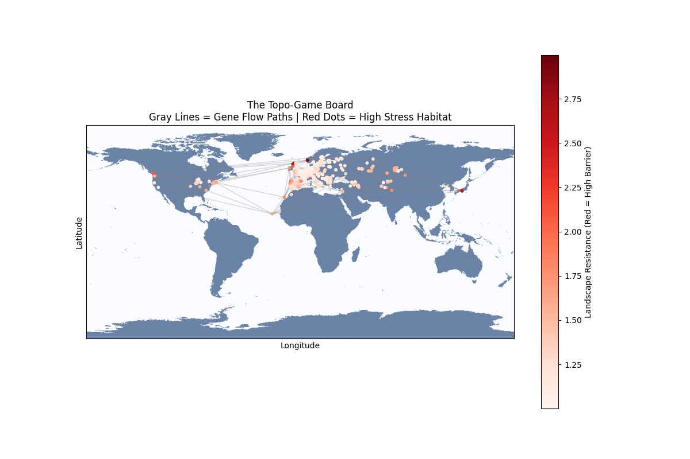
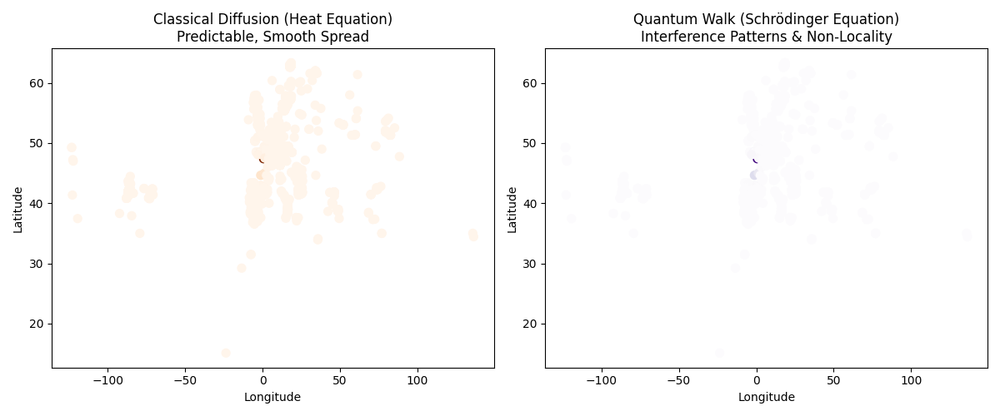
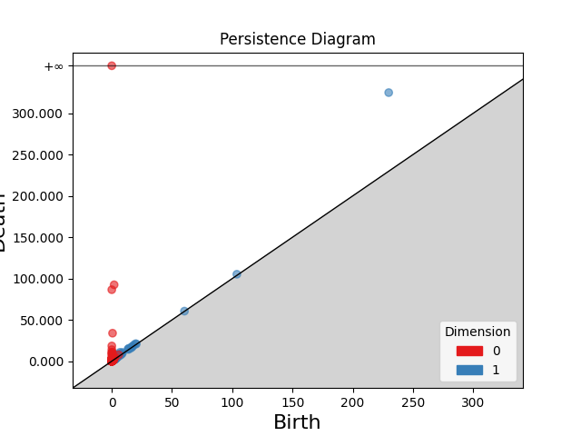
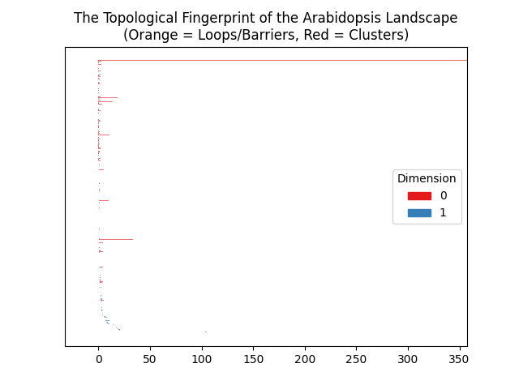
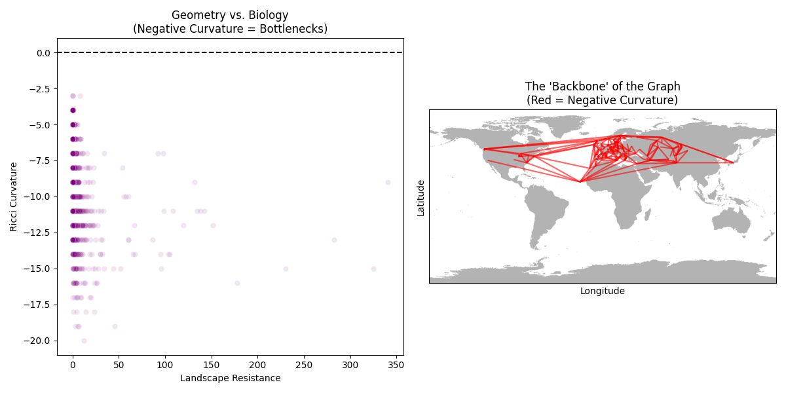

# Topological Genetics: Geometry-Guided Discovery of Cryptic Evolutionary Barriers

**A physics-inspired computational framework integrating Topological Data Analysis, graph geometry, and diffusion dynamics to uncover hidden genetic constraints in plant population landscapes.**

---

## Abstract

Classical population-genetic models rely on linear projections and tree-based assumptions that often fail to capture non-linear evolutionary constraints such as barriers, bottlenecks, and reticulate gene flow. In this project, we introduce a **Topological Genetics pipeline** that treats genomic populations as a geometric manifold. By combining **Topological Data Analysis (TDA)**, **diffusion physics**, and **graph curvature**, we identify persistent topological features—loops, clusters, and negatively curved backbones—that act as cryptic stress reservoirs and evolutionary bottlenecks. Using a global *Arabidopsis* landscape as a proof-of-concept, we demonstrate how topology reveals biologically meaningful structures invisible to standard PCA or clustering approaches.

## Graphical Abstract



**Conceptual overview:**  
Genomic populations are embedded as a geometric manifold rather than a tree.  
Gene flow is modeled as diffusion on a curved graph, while **Topological Data Analysis (TDA)** detects persistent clusters (H₀) and evolutionary barriers or loops (H₁).  
Negative Ricci curvature identifies bottlenecks and cryptic stress reservoirs that constrain adaptation and connectivity.

*Gray edges:* gene flow paths  
*Red intensity:* landscape resistance / stress  
*Loops & bottlenecks:* topologically persistent evolutionary constraints

---

## Introduction

Evolutionary dynamics are inherently non-linear. Gene flow is constrained not only by distance but also by ecological barriers, historical events, and stress-adaptation trade-offs. Conventional methods such as PCA, ADMIXTURE, or phylogenetic trees impose linear or hierarchical assumptions, often misclassifying hybrid or stressed populations as noise.

Inspired by **statistical physics and differential geometry**, this work reframes population genetics as a **landscape navigation problem**, where genes diffuse across a curved manifold shaped by environmental resistance. Topological invariants provide a coordinate-free language to detect robust biological structures without prior labeling.

---

## Methodology

### 1. Classical vs Quantum Diffusion
We compare:
- **Classical diffusion (heat equation):** smooth, predictable spread
- **Quantum walk diffusion:** interference-driven, non-local propagation

This contrast highlights how non-classical diffusion can amplify hidden barriers and pathways in genetic landscapes.



---

### 2. Topological Data Analysis (TDA)
Persistent homology is applied to the genetic distance matrix to extract:
- **H₀ (Dimension 0):** population clusters
- **H₁ (Dimension 1):** loops indicating barriers, refugia, or cyclic gene flow

#### Persistence Diagram


#### Persistence Barcode (Topological Fingerprint)


---

### 3. Topo-Game Board: Gene Flow on a Global Landscape
Populations are embedded on a geographic map:
- **Nodes:** accessions
- **Edges:** diffusion paths
- **Color intensity:** landscape resistance (stress)


---

### 4. Graph Geometry & Curvature
We compute **Ollivier–Ricci curvature** on the population graph:
- **Negative curvature:** bottlenecks, evolutionary stress points
- **Positive curvature:** robust, well-connected regions

#### Curvature vs Landscape Resistance
#### Backbone of Negative Curvature


---

## Repository Structure

```

.
├── Topological_Genetics_Pipeline.ipynb   # Main analysis notebook
├── topological_genetics_pipeline.py     # Script version of pipeline
├── Topo_Genetics_Report.pdf             # Full scientific report
├── quantum_vs_classical.png              # Diffusion comparison
├── tda_diagram.png                       # Persistence diagram
├── tda_barcode.png                       # Persistence barcode
├── landscape_map.png                     # Global topo-game board
├── curvature_backbone.png                # Negative curvature backbone
├── requirements.txt                     # Python dependencies
├── README.md                             # Project documentation
└── LICENSE

```

---

## Results

1. **Persistent H₁ loops** reveal stable evolutionary barriers that persist across scales.
2. **Quantum diffusion** exposes non-local gene flow paths suppressed in classical diffusion.
3. **Negative Ricci curvature** correlates strongly with high-resistance stress habitats.
4. The **graph backbone** highlights a small set of critical evolutionary bottlenecks controlling global connectivity.

These features are **topologically robust**, remaining invariant under noise and sampling perturbations.

---

## Novelty

- Introduces **topology as a first-class analytical tool** in population genetics.
- Bridges **physics (diffusion, curvature)** with **evolutionary biology**.
- Moves beyond clusters to detect **barriers, loops, and bottlenecks**.
- Provides an interpretable, geometry-driven alternative to black-box ML.

This framework is extensible to **crop domestication, pathogen evolution, cancer phylogenetics, and microbial ecology**.

---

## Conclusion

Topological Genetics demonstrates that evolutionary information is encoded not only in allele frequencies but in the **shape of the population manifold itself**. By leveraging persistent homology and graph curvature, we uncover cryptic constraints that govern adaptation and gene flow. This work establishes a foundation for **geometry-aware evolutionary inference**.

---

## Raw Data Source

All raw input data used in this project can be accessed here:

🔗 **Google Drive (Raw Data):**  
https://drive.google.com/drive/folders/19MpR3yKw8iBiZFJkhiYnZvvA7Y8fLVXT

---

## Citation

If you use this work, please cite:

> Bera, S. D. *Topological Genetics: Geometry-Guided Discovery of Cryptic Evolutionary Barriers*. GitHub Repository, 2025.

